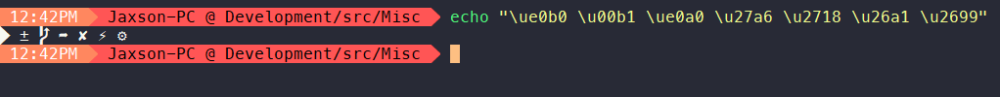

# Wagnoster ZSH and BASH Theme

A ZSH theme based on [agnoster-zsh-theme](https://github.com/agnoster/agnoster-zsh-theme).

Bash version also available which is adapted from [agnoster.bash](https://gist.github.com/kruton/8345450).

# Compatibility

**NOTE:** In all likelihood, you will need to install a [Powerline-patched font](https://github.com/Lokaltog/powerline-fonts) for this theme to render correctly.

To test if your terminal and font support it, check that all the necessary characters are supported by copying the following command to your terminal: `echo "\ue0b0 \u00b1 \ue0a0 \u27a6 \u2718 \u26a1 \u2699"`. The result should look like this:

## What does it show?

- If the previous command failed (✘)
- User @ Hostname (if user is not DEFAULT_USER, which can then be set in your profile)
- Git status
  - Branch () or detached head (➦)
  - Current branch / SHA1 in detached head state
  - Dirty working directory (±, color change)
- Working directory
- Elevated (root) privileges (⚡)

